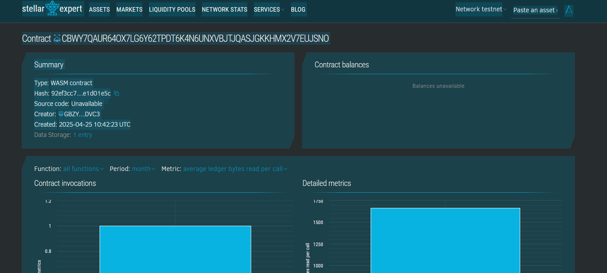

# Work-Life Balance Tracker Smart Contract

## 📌 Project Title
**Work-Life Balance Tracker**

## 🧾 Project Description
This smart contract allows users to track the number of hours they dedicate to work-related and life-related activities directly on the blockchain. It promotes mindfulness and personal well-being by giving users a transparent way to assess their work-life balance over time.

## 🎯 Project Vision
To help individuals build healthier daily habits by providing decentralized and immutable tracking of how they spend their time between work and personal life.

## ⭐ Key Features
- Log hours spent on **Work** and **Life** activities.
- Retrieve the total balance for **Work** vs **Life** time.
- Data stored securely and immutably on the **Stellar Soroban** smart contract layer.
- Lightweight, privacy-focused implementation with no personally identifiable information.

## 🔮 Future Scope
- Add support for multiple users with user-specific tracking.
- Enable visualization tools (e.g., via front-end dApp).
- Introduce goal-setting and notification features.
- Enable reward systems or incentives for healthy balance milestones.

## Contract Details
CBWY7QAUR64OX7LG6Y62TPDT6K4N6UNXVBJTJQASJGKKHMX2V7EUJSNO
